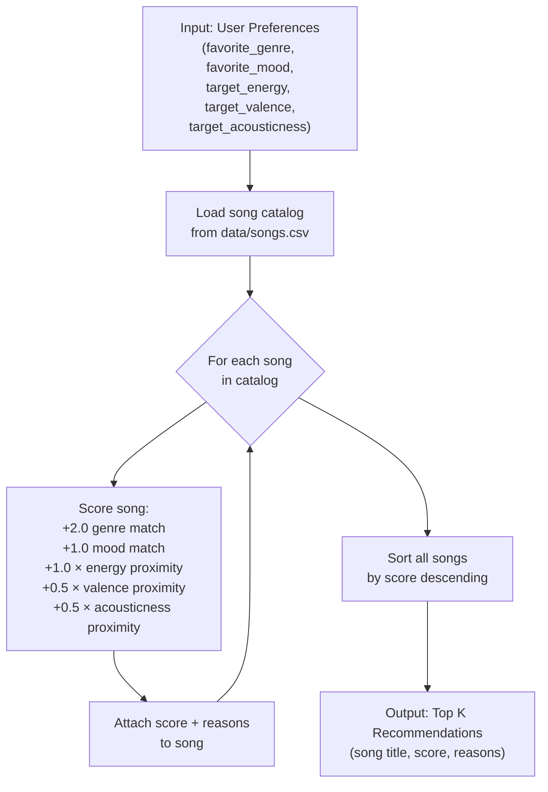

# 🎵 Music Recommender Simulation

## Project Summary

In this project you will build and explain a small music recommender system.

Your goal is to:

- Represent songs and a user "taste profile" as data
- Design a scoring rule that turns that data into recommendations
- Evaluate what your system gets right and wrong
- Reflect on how this mirrors real world AI recommenders

This version builds a content-based music recommender that scores every song in a catalog against a user's stated preferences (genre, mood, energy, valence, acousticness) and returns the top K matches. It is designed to be transparent — every recommendation comes with a plain-language explanation of why it was chosen.

---

## How The System Works

Real-world recommenders like Spotify or YouTube learn patterns from millions of listeners. They notice that people who like Artist A also tend to like Artist B, and they surface songs based on that collective behavior. Our version skips the crowd sourced learning and instead uses a hand-crafted content-based filter: it looks directly at the attributes of each song and compares them to a single user's stated preferences. This prioritizes transparency and control over personalization depth. What matters most in our system is genre alignment (the strongest signal), followed by mood context (e.g., "chill" for studying vs. "intense" for the gym), and then numerical proximity for energy, valence, and acousticness — rewarding songs that are close to the user's targets, not just the highest or lowest values.

### Song Features Used

Each `Song` object stores:
- `genre` — categorical (pop, lofi, rock, ambient, jazz, synthwave, indie pop)
- `mood` — categorical (happy, chill, intense, relaxed, focused, moody)
- `energy` — float 0.0–1.0 (how energetic the track feels)
- `valence` — float 0.0–1.0 (emotional positivity of the sound)
- `acousticness` — float 0.0–1.0 (acoustic vs. electronic character)
- `danceability` — float 0.0–1.0 (rhythmic groove)
- `tempo_bpm` — integer (raw beats per minute)

### UserProfile Features Used

Each `UserProfile` stores:
- `favorite_genre` — the genre to match against
- `favorite_mood` — the mood context to match against
- `target_energy` — desired energy level (0.0–1.0)
- `likes_acoustic` — boolean preference for acoustic vs. electronic sound

### Scoring Logic

```
score = 0
+2.0  if genre matches
+1.0  if mood matches
+1.0 × (1 − |song.energy − user.target_energy|)       # proximity reward
+0.5 × (1 − |song.valence − user.target_valence|)
+0.5 × (1 − |song.acousticness − user.target_acousticness|)
```

**Maximum possible score: 5.0**

Weight rationale: Genre carries 40% of the max score because cross-genre recommendations are rarely satisfying. Mood and energy are equal at 20% each — context (studying vs. gym) matters as much as physical intensity. Valence and acousticness act as tie-breakers at 10% each.

### Recommendation Process

1. Load all songs from `data/songs.csv`
2. For each song, compute a score using the Scoring Rule above
3. Sort all scored songs in descending order
4. Return the top K songs as recommendations

### Flowchart



### Potential Biases

- This system may over-prioritize genre — a great mood/energy match in the wrong genre will always lose to a mediocre same-genre song.
- Genres with more songs in the catalog (lofi has 3 entries vs. 1 for metal) give users of those genres more candidates, producing better results simply due to catalog imbalance.
- Numerical proximity scores always contribute something even for a bad match, so weak candidates are never fully eliminated — they can still surface in thin catalogs.

---

## Getting Started

### Setup

1. Create a virtual environment (optional but recommended):

   ```bash
   python -m venv .venv
   source .venv/bin/activate      # Mac or Linux
   .venv\Scripts\activate         # Windows

2. Install dependencies

```bash
pip install -r requirements.txt
```

3. Run the app:

```bash
python -m src.main
```

### Running Tests

Run the starter tests with:

```bash
pytest
```

You can add more tests in `tests/test_recommender.py`.

---

## Experiments You Tried

Use this section to document the experiments you ran. For example:

- What happened when you changed the weight on genre from 2.0 to 0.5
- What happened when you added tempo or valence to the score
- How did your system behave for different types of users

Three profiles were tested against the 18-song catalog:

- **High-Energy Pop** — "Sunrise City" scored 4.90 (genre + mood + energy match). "Storm Runner" (rock) appeared at rank 5 with no categorical match, scoring entirely on energy proximity — one strong number was enough to surface an otherwise wrong result.
- **Chill Lofi** — Two songs tied at 4.92. Having 3 lofi songs in the catalog gave this profile noticeably stronger top-3 results than any other profile.
- **Deep Intense Metal** — "Iron Will" scored 4.98, but ranks 2–5 fell back to rock, EDM, and pop because only one metal song exists. The algorithm worked correctly; the catalog was the bottleneck.

---

## Limitations and Risks

Summarize some limitations of your recommender.

Examples:

- It only works on a tiny catalog
- It does not understand lyrics or language
- It might over favor one genre or mood

You will go deeper on this in your model card.

- Genre weight (40% of max score) means a mediocre same-genre song always beats a near-perfect cross-genre match.
- Genres with only one song in the catalog (metal, country, folk) produce weak results beyond rank 1.
- Numerical proximity always adds a positive score, so weak candidates are never fully eliminated in a thin catalog.

---

## Reflection

Read and complete `model_card.md`:

[**Model Card**](model_card.md)

Write 1 to 2 paragraphs here about what you learned:

- about how recommenders turn data into predictions
- about where bias or unfairness could show up in systems like this

Building this system showed that recommenders work by reducing complex, subjective things (songs, taste) into numbers and finding the closest match. That process works well for clear-cut profiles but misses anything the numbers can't capture — tone, lyrics, cultural context.

The bias lesson was the most surprising: the algorithm didn't need to be written unfairly to produce unequal results. A metal listener and a lofi listener using the exact same scoring logic get different quality recommendations simply because the catalog has more lofi songs. Unfairness can come entirely from the data, not the code.


---

## 7. `model_card_template.md`

Combines reflection and model card framing from the Module 3 guidance. :contentReference[oaicite:2]{index=2}  

```markdown
# 🎧 Model Card - Music Recommender Simulation

## 1. Model Name

Give your recommender a name, for example:

> VibeFinder 1.0

---

## 2. Intended Use

- What is this system trying to do
- Who is it for

Example:

> This model suggests 3 to 5 songs from a small catalog based on a user's preferred genre, mood, and energy level. It is for classroom exploration only, not for real users.

---

## 3. How It Works (Short Explanation)

Describe your scoring logic in plain language.

- What features of each song does it consider
- What information about the user does it use
- How does it turn those into a number

Try to avoid code in this section, treat it like an explanation to a non programmer.

---

## 4. Data

Describe your dataset.

- How many songs are in `data/songs.csv`
- Did you add or remove any songs
- What kinds of genres or moods are represented
- Whose taste does this data mostly reflect

---

## 5. Strengths

Where does your recommender work well

You can think about:
- Situations where the top results "felt right"
- Particular user profiles it served well
- Simplicity or transparency benefits

---

## 6. Limitations and Bias

Where does your recommender struggle

Some prompts:
- Does it ignore some genres or moods
- Does it treat all users as if they have the same taste shape
- Is it biased toward high energy or one genre by default
- How could this be unfair if used in a real product

---

## 7. Evaluation

How did you check your system

Examples:
- You tried multiple user profiles and wrote down whether the results matched your expectations
- You compared your simulation to what a real app like Spotify or YouTube tends to recommend
- You wrote tests for your scoring logic

You do not need a numeric metric, but if you used one, explain what it measures.

---

## 8. Future Work

If you had more time, how would you improve this recommender

Examples:

- Add support for multiple users and "group vibe" recommendations
- Balance diversity of songs instead of always picking the closest match
- Use more features, like tempo ranges or lyric themes

---

## 9. Personal Reflection

A few sentences about what you learned:

- What surprised you about how your system behaved
- How did building this change how you think about real music recommenders
- Where do you think human judgment still matters, even if the model seems "smart"

